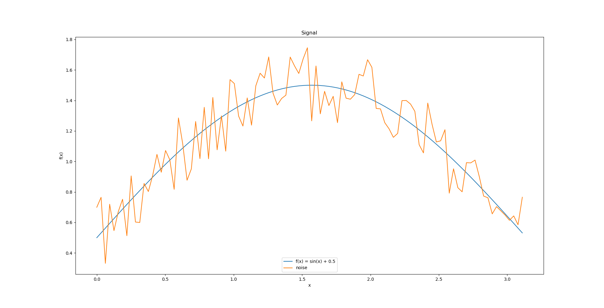
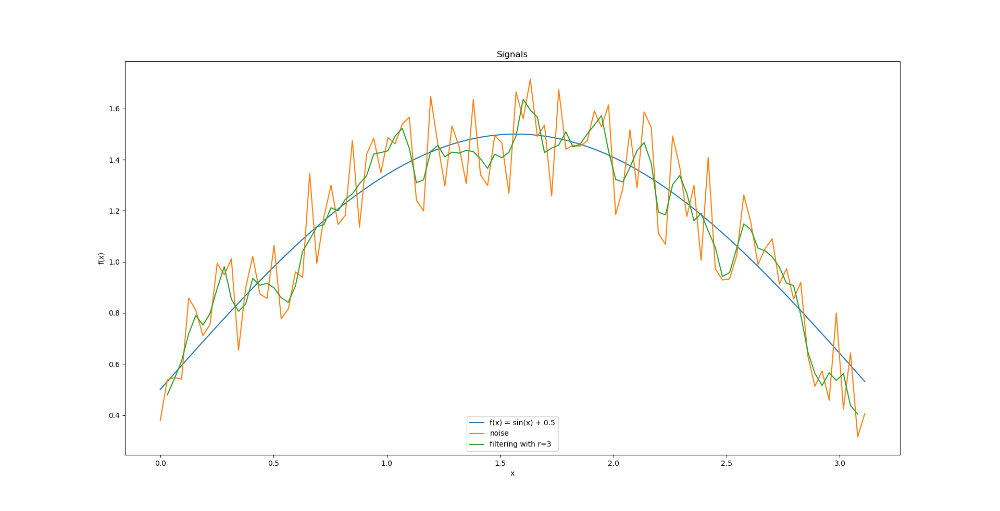
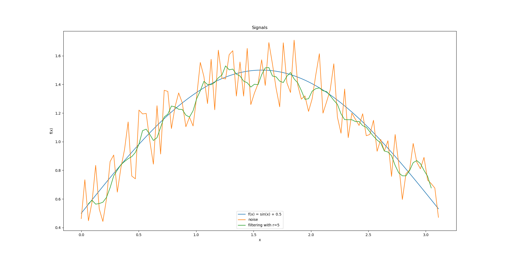

# Исследование стохастической фильтрации сигналов
**Задача:** создать алгоритм, в основе которого лежат основные принципы многокритериальной оптимизации в комбинации с
методами случайного и прямого пассивного поиска, реализующий фильтрацию
дискретного сигнала методом взвешенного скользящего среднего

В задачу входит:
В задачу входит:
- Программная реализация алгоритма
- Проведение анализа полученных результатов
- Оформление отчета

## Реализация:
### Исходный сигнал

### Сигнал после наложения шума:

### Результаты фильтрации
#### Размер окна 3

#### Размер окна 5

