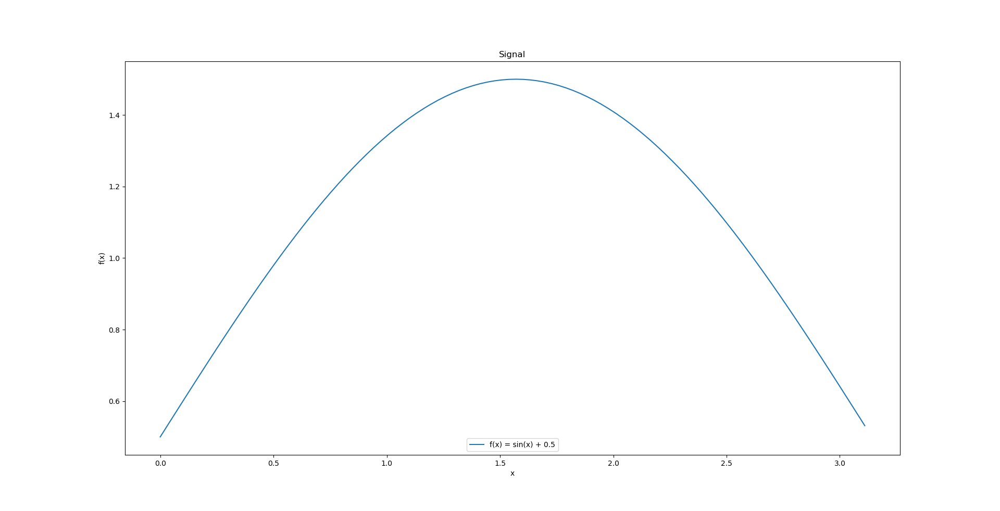
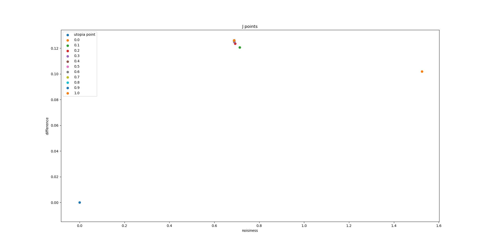
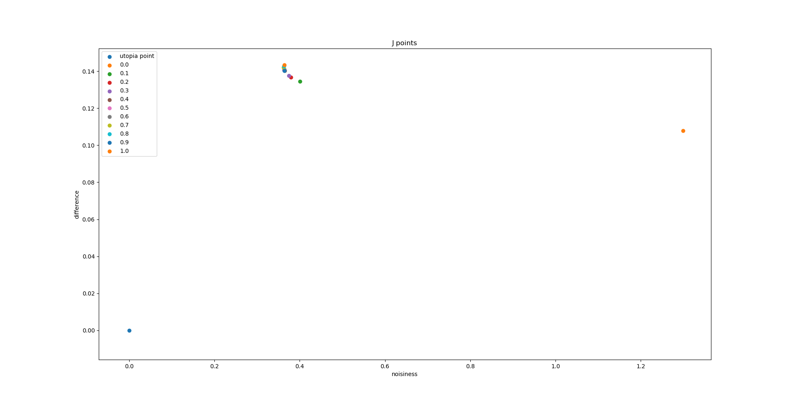

# Исследование стохастической фильтрации сигналов
**Задача:** создать алгоритм, в основе которого лежат основные принципы многокритериальной оптимизации в комбинации с
методами случайного и прямого пассивного поиска, реализующий фильтрацию
дискретного сигнала методом взвешенного скользящего среднего

В задачу входит:
- Программная реализация алгоритма
- Проведение анализа полученных результатов
- Оформление отчета

## Исходный сигнал

## Сигнал после наложения шума:

## Результаты фильтрации
### Размер окна 3
#### Приближения различных J к точке утопии

#### Отфильтрованный сигнал

#### Размер окна 5
#### Приближения различных J к точке утопии

#### Отфильтрованный сигнал
